# Hi, I nihosprop! 👋

🚀 **Python-Developer** 👉 [My Telegram](https://t.me/Shinobiwin) | [My Stepik](https://stepik.org/users/632745189/profile)

  
  
  

[//]: # ([![Harlok's WakaTime stats]&#40;https://github-readme-stats.vercel.app/api/wakatime?username=shinobiwin&cache_seconds=1800&#41;]&#40;https://github.com/nihosprop/github-readme-stats&#41;)
## 🔥 Active projects
- [Bot Stepik Guard](https://github.com/nihosprop/bot_stepik_guard.git) - Smart monitoring of comments on Stepik
- [Bot Get Cert](https://github.com/nihosprop/bot_get_cert.git) - Smart generation of certificates from a team of courses published on Stepik

## 🛠️ Technological stack

